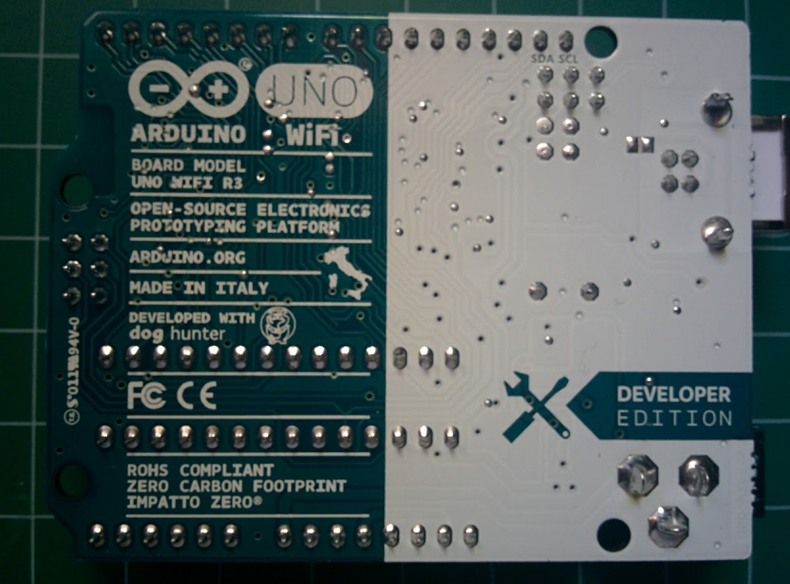
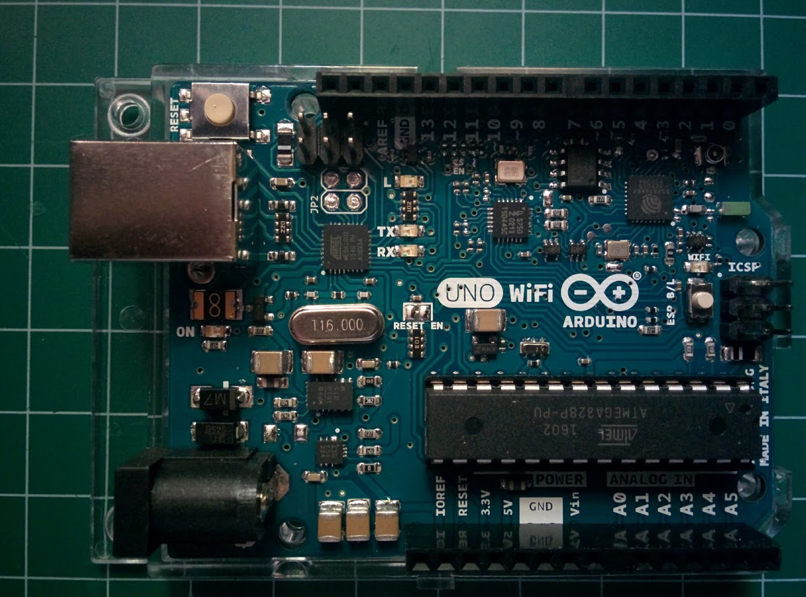
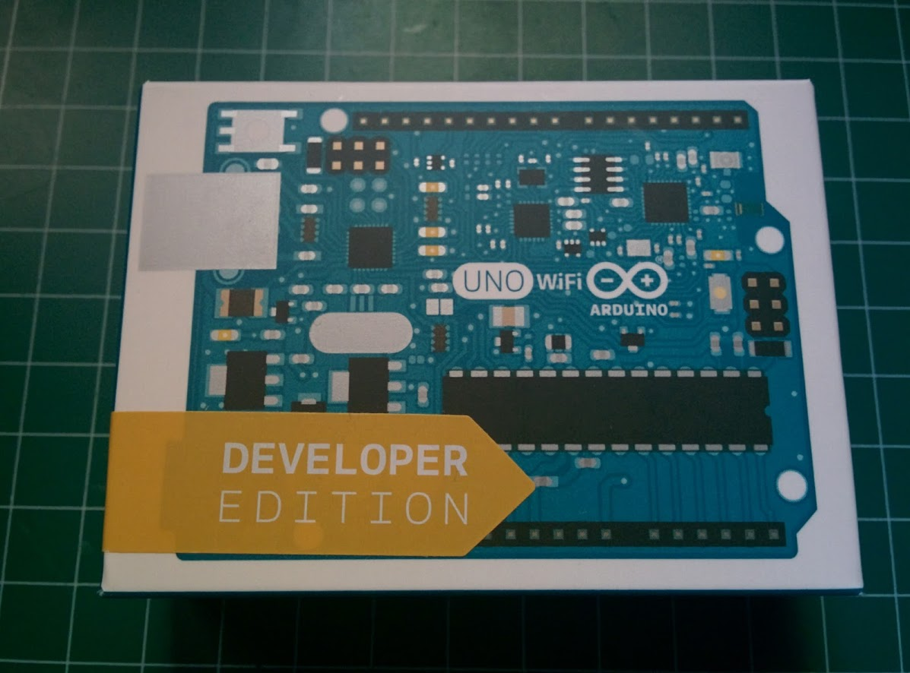
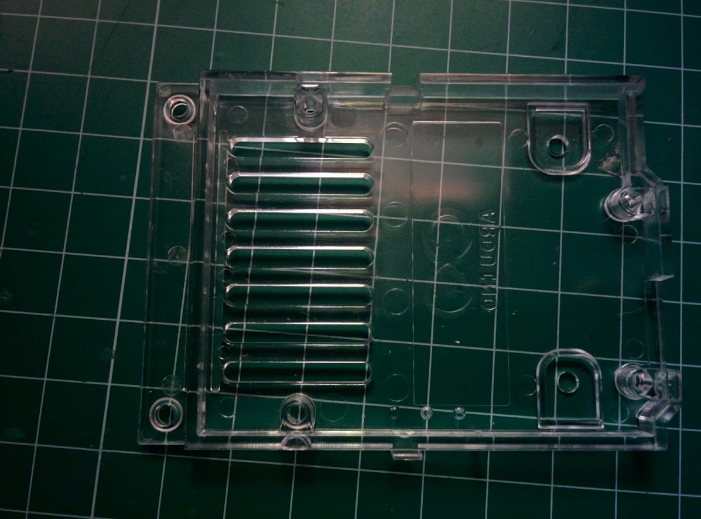
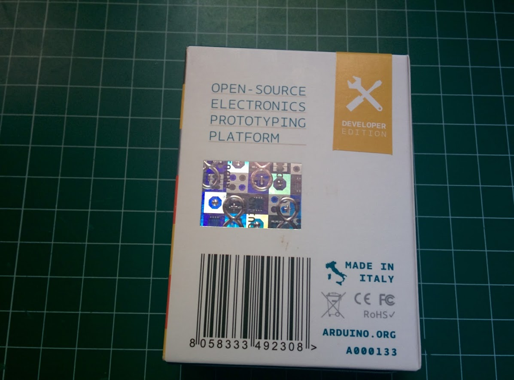
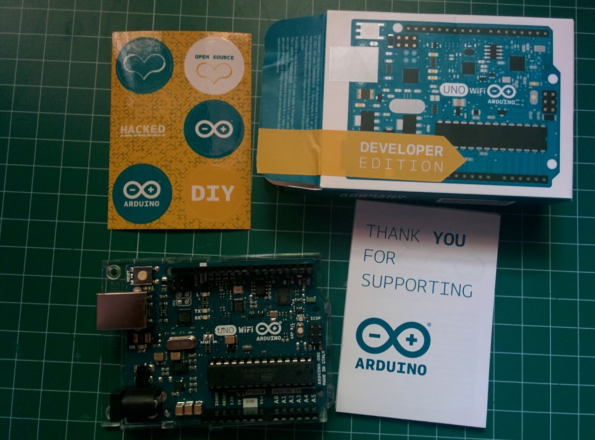

# Arduino UNO Wifi

He tenido el placer de probar una placa [Arduino UNO Wifi](http://www.arduino.org/products/boards/arduino-uno-wifi) que nos ha enviado Bricogeek para que la podamos probar.

En un [curso de nuevas tecnologías](https://github.com/javacasm/EscuelaArte) para algunos profesores la [Escuela de Arte de Granada](http://www.escuelaartegranada.com/) estábamos tratando las comunicaciones y tras trabajar con [Bluetooth](https://github.com/javacasm/EscuelaArte/blob/master/bluetooth.md), hemos empezado con el wifi.

## ¿Arduino Wifi?

La placa [Arduino UNO Wifi] no es otra cosa que una placa Arduino UNO con un [ESP8266](http://www.esp8266.com/) integrado que le proporciona la conectividad Wifi

### Características

Microcontrolador: ATMega328 @ 16 MHz
Módulo Wifi ESP8266EX @ 80 MHz 802.11 b/g/n 2.4 GHz
Voltaje de funcionamiento (pines I/O): 5V
Alimentación: 7 a 12 V
Memoria Flash: 32 Kb
SRAM: 2Kb
Pines I/O: 20
Salidas PWM: 6
Consumo: 93 mA
Pines analógicos: 6
EEPROM: 1Kb

## Contenido de la caja

     

  
  

## Uso

Descargamos el [IDE de arduino.org](http://www.arduino.org/downloads) (la numeración es engañosa y no quiere decir que sea más avanzado que la versión 1.6.9 de arduino.cc)
